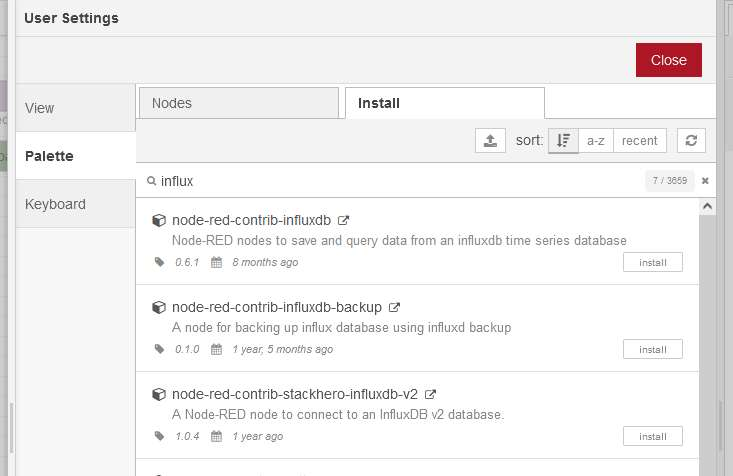

# Telemetry stack
Stack for receive, store and display data.

>This stack is primary designed for Raspberry Pi. Raspberry Pi OS is 32bit. InfluxDB version >=2 does not have docker image for this architecture. In this case is needed to use InfluxDB version 1.8. In "telemetry/64bit" is docker compose file for InfluxDB v2. There are some differences in configuration and connection with other services. But is simple and straight forward. This guide covers InfluxDB v1.8.

Stack consists from these technologies:
* Portainer.io
* MQTT Broker
* NodeRed
* InfluxDb
* Grafana

>This setup using docker containers. Docker in default add records into iptables. This cause when you set your own iptables firewall as UFW, docker exposed ports will be still exposed and accessible from outside. Docker bypass UFW. Read more here https://github.com/chaifeng/ufw-docker#solving-ufw-and-docker-issues . To not manipulate with iptables you have some options. Expose ports only for localhost if it is not necessary to access them from outside or place server behind the firewall and setup port forwarding for specific services.

# Setup
## Pre check
If you are on Raspberry Pi or similar micro computer. Check your architecture.
```bash
uname -m
```

If is architecture ```armv7l``` use ```telemetry/docker-compose.yml```.

## Raspberry Pi
### WiFi preconfiguration
After you flash your sd card with latest Raspberry OS add file ```wpa_supplicant.conf``` into boot partition. And change it for your country and WiFi settings.

```
ctrl_interface=DIR=/var/run/wpa_supplicant GROUP=netdev
update_config=1
country=US

network={
    ssid="YOURSSID"
    psk="YOURPASSWORD"
    scan_ssid=1
}
```

Make sure that line endings is ```LF``` for unix and **NOT** ```CRLF``` for windows.

After first boot this information will be used for WiFi connection.

In case you want to access Raspberry via ssh, you need to add empty file named ```ssh``` into boot partition. On all three major systems Windows, Linux, OSx it could be possible open terminal in boot partition and just type

```bash
touch ssh
```

### Static IP
>For setting static ip for you RPi server, you can use your router settings and assign specific IP address to MAC address of you RPi server. I use this in case I know I will move server between networks. 

Check your default interface and address.
```bash
ip r | grep default
```

You will get something like this
```bash
default via 192.168.1.1 dev wlan0 proto dhcp src 192.168.1.213 metric 303 
```

My RPi server is connected via ```wlan0``` using WiFi. In case you use ethernet cable, there will be probably ```eth0```.

```192.168.1.1``` is in this case default gateway (your router) and ```192.168.1.213``` is IP address Raspberry got from router via DHCP.


Check DNS configuration for your server. Configuration is in file ```/etc/resolv.conf```. Look something like this:
```
# Generated by resolvconf
domain localdomain
nameserver 192.168.1.1
```

If you got configuration via DHCP from your local router there will be mostly IP address of this router. You can use alternatives such as 8.8.8.8 for Google or 1.1.1.1 for Cloudflare.

For static IP settings you have to edit file ```/etc/dhcpcd.conf```. There will be bunch of examples. For example if you want configuration for you server as
* interface: wlan0
* ip: 192.168.1.250
* mask: 255.255.255.0
* router ip: 192.168.1.1
* dns: 192.168.1.1 1.1.1.1

add this at file bottom

```
interface wlan0
static ip_address=192.168.1.250/24
static routers=192.168.1.1
static domain_name_servers=192.168.1.1 1.1.1.1
```

Save and then reboot Raspberry.

## Initial
```bash
# install packages
sudo apt update && sudo apt upgrade -y
sudo apt install mc htop git build-essential -y
sudo apt install docker.io docker-compose -y

# let user run docker without switching to root
# create docker group if not exists
sudo groupadd docker

# add current user to the docker group
# after this you need to log out and log in to make it work
sudo usermod -aG docker $USER
```

And then clone this repo.

## Pre Compose Up
### .env
Make sure you create ```.env``` file in ```$HOME/telemetry-stack/telemetry```.
```bash
GF_SECURITY_ADMIN_USER=<admin username>
GF_SECURITY_ADMIN_PASSWORD=<admin password>

DOCKER_INFLUXDB_INIT_USERNAME=admin
DOCKER_INFLUXDB_INIT_PASSWORD=<admin password>
DOCKER_INFLUXDB_INIT_DATABASE=<default database name>
```

### Grafana
Generate Grafana config file.

```bash
cd $HOME/telemetry-stack/grafana
docker run --rm --entrypoint /bin/bash grafana/grafana:latest -c 'cat $GF_PATHS_CONFIG' > grafana.ini
``` 

Make data folder owned by grafana.
```bash
chown 472:472 $HOME/telemetry-stack/grafana/data
```

Make ```.env``` file part for Grafana.
```bash
GF_SECURITY_ADMIN_USER=<admin username>
GF_SECURITY_ADMIN_PASSWORD=<admin password>
```

### InfluxDB
Make ```.env``` file part in in ```$HOME/telemetry-stack/telemetry/``` for InfluxDb.

```bash
DOCKER_INFLUXDB_INIT_USERNAME=admin
DOCKER_INFLUXDB_INIT_PASSWORD=<admin password>
DOCKER_INFLUXDB_INIT_DATABASE=<default database name>
```

Make config file
```bash
cd $HOME/telemetry-stack/influxdb

docker run --rm influxdb:1.8.10 influxd config > influxdb.conf
```

### Mosquitto
Create ```pwfile``` in ```$HOME/telemetry-stack/mosquitto/config```

```bash
cd $HOME/telemetry-stack/mosquitto/config
touch pwfile
```

Create configuration ```mosquitto.conf``` in ```$HOME/telemetry-stack/mosquitto/config```

```
listener 1883         
persistence true
persistence_location /mosquitto/data    
persistence_file mosquitto.db
log_dest syslog
log_dest stdout
log_dest topic
log_dest file /mosquitto/log/mosquitto.org
log_type error
log_type warning
log_type notice
log_type information
connection_messages true
log_timestamp true
allow_anonymous false
password_file /mosquitto/config/pwfile
```

## Compose Up
Go to ```$HOME/telemetry-stack/telemetry/``` Make sure you have setup ```.env``` file and run.

```bash
docker-compose up -d
```

Docker download and run all images. You can see something like this.
```bash
pi@raspberrypi:~/telemetry-stack/telemetry $ docker-compose up -d
Creating network "telemetry_default" with the default driver
Creating volume "telemetry_portainer_data" with default driver
Pulling portainer (portainer/portainer-ce:latest)...
latest: Pulling from portainer/portainer-ce
0ea73420e2bb: Pull complete
c367f59be2e1: Pull complete
4bb294c1afcb: Pull complete
Digest: sha256:4f126c5114b63e9d1bceb4b368944d14323329a9a0d4e7bb7eb53c9b7435d498
Status: Downloaded newer image for portainer/portainer-ce:latest
Pulling nodered (nodered/node-red:)...
latest: Pulling from nodered/node-red
80ca8924263d: Pull complete
497280a25128: Pull complete
e67910a1bf8f: Pull complete
6702d9426491: Pull complete
e3c0d7fc0224: Pull complete
dfcd25b0e60f: Pull complete
0392ea6bab71: Pull complete
6f2857417d4e: Pull complete
7ae38046675d: Pull complete
d70da68e4d96: Pull complete
10732b1596da: Pull complete
6bd11fb15429: Pull complete
0a18672a717f: Pull complete
Digest: sha256:706ffc11f6f9df17febde1e9588801cbe4666b3dc56aedea83ff88e3664ec13a
Status: Downloaded newer image for nodered/node-red:latest
Pulling mosquitto (eclipse-mosquitto:)...
latest: Pulling from library/eclipse-mosquitto
56afcfda5d78: Pull complete
7cc5dfa21678: Pull complete
193ff21ebef8: Pull complete
Digest: sha256:64b7c1729f7d1fff46b5e884fc389071686b2f7ed116c3fc7e17cbcb50fa147e
Status: Downloaded newer image for eclipse-mosquitto:latest
Creating grafana   ... done
Creating portainer ... done
Creating mosquitto ... done
Creating nodered   ... done
Creating influxdb  ... done
```

## Post Compose Up
>Since we have all services in one stack we will use it for communication between them. When you setup communication in the stack you can use container_name as service domain name.

After ```docker-compose up``` you can check running service which does not need configuration. In your browser enter ```http://<your server ip>:9000``` to access portainer. 

### Portainer
Portainer sits on port ```9000```

When you first time enter into portainer you can see admin user setup.


After you create admin user and ```Get started``` in Portainer, you can find your stack and running containers inside. In case of error you can check logs or restart services.


### InfluxDB
Influx sits on port ```9000```

### Mosquitto
Mosquitto sits on port ```1883```

Add user:
```bash
cd $HOME/telemetry-stack/telemetry

docker-compose exec mosquitto mosquitto_passwd -c /mosquitto/config/pwfile telemetry
```

Then restart mosquitto container.

### NodeRED
NodeRED sits on port ```1880```

Enter ```http://<your server ip>:1880``` in your browser


#### MQTT
For test if Mosquitto running well setup simple flow.


Open any ```mqtt``` node and setup broker.


Use container name ```mosquitto``` as domain name.


Use user you created in ```Post Compose Up Mosquitto setup```.


Click on ```Add```. :)

For mqtt output node setup QoS ```1``` and Retain ```true```.


Setup ```inject``` node for sending test message into mqtt.


Setup listening mqtt node for test topic.


Then deploy. You should see something like this.


Open debug messages.


Activate inject node.


In debug messages you should see something like this.


Congrats you sent and received message via mqtt.

#### InfluxDB
Install InfluxDB palette.



Add InfluxDB output node, open and setup server.


Use InfluxDB credentials.


Update previous flow.


Setup measurement for output InfluxDB node.


Setup custom function. This function prepare data for InfluxDB.


Update flow agin for reading from InfluxDB.


Setup InfluxDB read node with query.


Activate ```/enviro/temperature``` and check debug messages.


Congrats! You just sent temperature into mqtt. Red from mqtt. You wrote it into InfluxDB and red from InfluxDB. :)

### Grafana
Grafana sits on port ```3000```

Enter ```http://<your server ip>:3000``` in your browser and login.

#### Add data source
Add and setup InfluxDB data source.


#### Display values
Go to new dashboard


And add new panel.


Use InfluxDB source and setup query.


Select visual.


Use suggested line chart.


Apply and you can see you new panel.


Congrats! Now you can display values from InfluxDb.

When you have more data it can look like this :)


# Influx DB v2
## .env
```
DOCKER_INFLUXDB_INIT_USERNAME=admin
DOCKER_INFLUXDB_INIT_PASSWORD=<admin password>
DOCKER_INFLUXDB_INIT_ORG=<organization name>
DOCKER_INFLUXDB_INIT_BUCKET=<default bucket name>
```
# Sources

https://blog.anoff.io/2021-01-howto-grafana-on-raspi/

https://techoverflow.net/2021/11/25/how-to-setup-standalone-mosquitto-mqtt-broker-using-docker-compose/

https://hub.docker.com/_/eclipse-mosquitto

https://blog.feabhas.com/2020/02/running-the-eclipse-mosquitto-mqtt-broker-in-a-docker-container/

https://github.com/vvatelot/mosquitto-docker-compose

https://sensorsiot.github.io/IOTstack/Containers/Mosquitto/

https://blog.anoff.io/2020-12-run-influx-on-raspi-docker-compose/

https://pumpingco.de/blog/setup-your-raspberry-pi-for-docker-and-docker-compose/